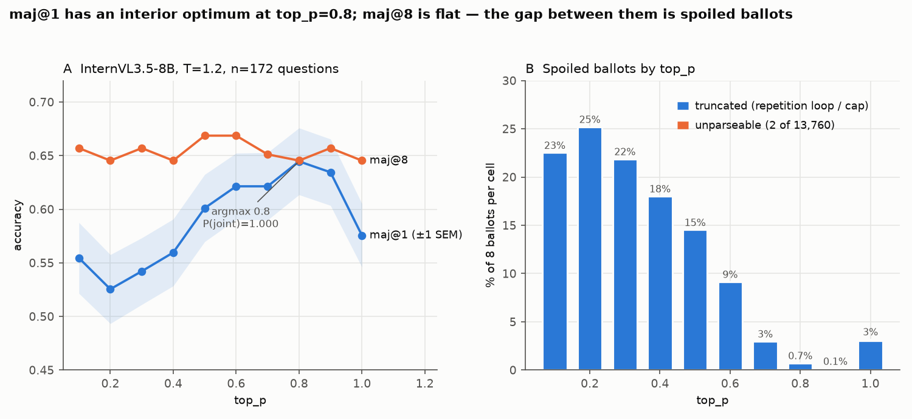
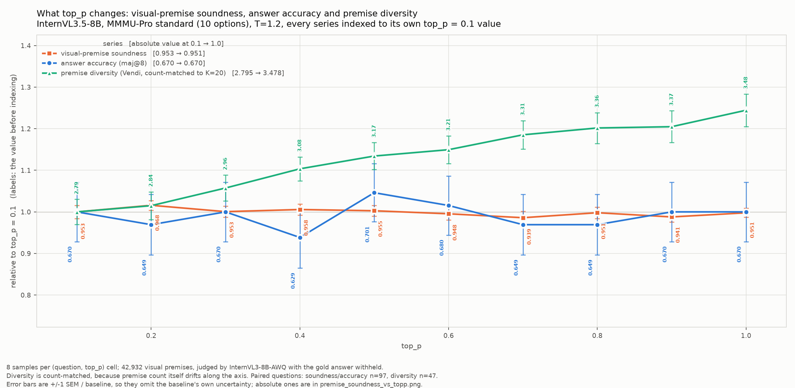

# A second model for the `top_p` question: InternVL3.5-8B at T=1.2

A second-model arm for the Qwen3.5-9B `top_p` study in `../qwen35_9b_cot_diversity`. Same
question — as `top_p` rises, is there an interior optimum in accuracy? — same prompt, same
ballot rule, same tests. What differs is stated here and stamped into every data row.

## 1. The headline

**At k=1 there is a clear interior optimum at `top_p`=0.8** (0.525 → 0.645 → 0.576;
F=17.47, p≈0, P(shape)=1.000, **P(joint)=1.000**, quadratic a=−0.197, Holm p<0.0001).
**At k=8 the curve is flat** (range 0.023, F=0.36, p=0.955).

That pair looks like the Qwen T=1.0 arm's puzzle, and it has the same resolution — but the
decomposition below shows the k=1 optimum is **not** what it appears to be.

## 2. The k=1 rise is the counting rule, not better reasoning

Decomposing maj@1 = (accuracy among valid traces) × (1 − spoiled), on all 172 questions:

| `top_p` | 0.1 | 0.2 | 0.3 | 0.4 | 0.5 | 0.6 | 0.7 | 0.8 | 0.9 | 1.0 |
|---|---|---|---|---|---|---|---|---|---|---|
| spoiled | 22.5% | 25.2% | 21.9% | 18.0% | 14.5% | 9.2% | 3.0% | 0.7% | 0.2% | 3.2% |
| **acc among valid** | **.716** | .703 | .694 | .683 | .703 | .684 | .640 | .649 | .635 | .595 |
| maj@1 | .555 | .525 | .542 | .560 | .601 | .621 | .621 | **.645** | .634 | .576 |
| maj@8 | .657 | .645 | .657 | .645 | .669 | .669 | .651 | .645 | .657 | .645 |

**Conditional on finishing, the model is most accurate at low `top_p` and declines monotonically**
(.716 → .595). The rising left arm of the k=1 inverted U is entirely the ballot rule's truncation
penalty — repetition loops spoiling 22–25% of ballots at `top_p` ≤ 0.3. The falling right arm is
real in both views.

This settles the "one untested mechanism" left open by the Qwen README: truncation shrinking the
vote pool is what the k=1 left arm measures.

## 3. Why maj@8 is flat: two opposing effects of equal size

maj@8 is not bracketed by the other two rows, and that is informative rather than odd.
`acc among valid` is the accuracy of a **single** finished trace; maj@8 aggregates ~8 of them,
so it can beat that (self-consistency) or lose to it (nothing to aggregate).

| `top_p` | acc_valid | maj@8 | gain | valid ballots/cell | cells with 0 valid | distinct answers/cell |
|---|---|---|---|---|---|---|
| 0.1 | .716 | .657 | **−.059** | 6.20 | 8 | 1.20 |
| 0.2 | .703 | .645 | −.057 | 5.98 | 6 | 1.23 |
| 0.3 | .694 | .657 | −.037 | 6.25 | 4 | 1.42 |
| 0.4 | .683 | .645 | −.037 | 6.56 | 1 | 1.47 |
| 0.5 | .703 | .669 | −.035 | 6.84 | 2 | 1.51 |
| 0.6 | .684 | .669 | −.015 | 7.27 | 1 | 1.60 |
| 0.7 | .640 | .651 | +.011 | 7.76 | 0 | 1.62 |
| 0.8 | .649 | .645 | −.004 | 7.94 | 0 | 1.71 |
| 0.9 | .635 | .657 | +.022 | 7.99 | 0 | 1.68 |
| 1.0 | .595 | .645 | **+.051** | 7.74 | 0 | 2.08 |

At low `top_p` sampling is near-greedy — **1.20 distinct answers per cell**, so a majority vote has
nothing to aggregate — and spoilage kills whole cells outright (8 cells with zero valid ballots,
which are failures under the ballot rule). At high `top_p` there is real diversity (2.08) and no
dead cells, so self-consistency gains 5 pp over a single trace.

Across the grid `acc among valid` falls **−.121** while the aggregation gain rises **+.110**. They
nearly cancel. **The flat maj@8 is two substantial opposing effects, not the absence of any.**

## 4. The pre-declared prediction fails again

`optimum non-decreasing in k` is **VIOLATED** (k=1→0.8, k=8→0.5), as in both Qwen arms.
Three arms, three violations.

## 5. Method

| | Qwen3.5-9B arms (reference) | **this arm** |
|---|---|---|
| model | `Qwen/Qwen3.5-9B` (70.1 MMMU-Pro, published) | `OpenGVLab/InternVL3_5-8B` (InternViT-300M + Qwen3-8B; **MMMU-Pro unpublished — measured here**) |
| temperature | 1.0 and 1.6 | **1.2** |
| `top_p` grid | 0.5–1.0 (10 pts) / 0.1–1.0 (9 pts) | **0.1–1.0 step 0.1 (10 pts)** |
| samples / cell | 16 | **8** |
| questions | 345 (20%) / 86 (5%) | **172 (10%), nested from the 5% seed** → contains the Qwen T=1.6 arm's 86-q set exactly and is a strict subset of the 345-q T=1.0 set |
| `top_k` | −1 | **−1** — `top_p` is the only truncation knob |
| thinking | chat-template `enable_thinking` | **model-card `R1_SYSTEM_PROMPT`** (the only mechanism this model has); emits `<think>…</think>` |
| `max_model_len` / `max_tokens` | 49152 / 40960 | **40960 / 40960** — see caveats |
| KV cache | bf16 | **bf16 (identical)** |

**Counting (unchanged).** Every (question, `top_p`) cell has exactly 8 ballots. A ballot is valid
iff the trace terminated (`finish_reason == "stop"`) and an answer parsed; otherwise it is spoiled —
it consumed budget and does not vote. Nothing is dropped. `analyze.py` prints the per-`top_p` spoil
rate, refuses a glob spanning two temperatures, **refuses a glob spanning two models** (added here:
`cfg_profile` is `neutral` for both arms, so only the stamped model id can catch it), refuses any
cell holding more ballots than the rest, and **warns when an argmax lands on a grid endpoint**
(where the two-lines test returns False by construction — see §7).

**Why T=1.2.** The Qwen arms found no interior optimum at T=1.0 and a clear one at T=1.6. The
mechanism offered there — at T≤1 lowering `top_p` only sharpens, so no worse-than-the-model regime
exists; above 1 the tail is inflated and truncation does real work — predicts curvature that grows
with T. 1.2 sits inside that window, on a different model family and vision-encoder lineage. The
model card recommends T=0.6 for thinking mode "to mitigate undesired repetition"; 1.2 is
deliberately above it, so a repetition-loop truncation arm at low `top_p` is expected and is
**counted as spoiled ballots, never dropped**.



*A: maj@1 (±1 SEM) and maj@8 vs `top_p`. B: spoiled ballots, split into truncated and unparseable.
The figure is single-arm by design — it reads only this directory's committed dataset. The
accuracy-among-valid decomposition that explains the contrast between the two curves is in §2.*

## 6. Caveats

**Context.** InternVL3.5-8B's LLM declares a 40,960-token context with no rope scaling. Running
`max_model_len=49152` (the Qwen value) under `VLLM_ALLOW_LONG_MAX_MODEL_LEN=1` was tried and is
**not viable**: the rotary table is sized to 40,960 and the engine dies with a CUDA device-side
assert the moment any trace crosses that position — which every capped trace does. So
`max_model_len=40960`, and because that equals `max_tokens`, **the prompt eats into the output
budget**: measured across the capped traces, the effective output cap is 32,287–40,456 tokens
(prompt = 504–8,673). The effective cap therefore differs from Qwen's only on the already-spoiled tail.

**`top_k` is not quite "the model's default".** `generation_config.json` ships no sampling
parameters, which is what justifies `top_k=-1`. But the model card's *example code* uses
`GenerationConfig(top_k=50, top_p=0.95, temperature=0.6, ...)`. Pinning `top_k` is required to
sweep `top_p` cleanly, and −1 is the right neutral choice, but a reader following the card would
be running with `top_k=50`.

**Two machines.** 162 questions were generated on 4× RTX 5090 (data-parallel, TP=1); the final 10
on 4× RTX 4090 (TP=4, required because one 40,960-token trace needs 5.62 GiB of bf16 KV and a
single 4090 has ~4.65 GiB free after weights, so vLLM refuses to start at TP=1). Software is
identical, `sampling_cfg` is byte-identical across both passes (verified), TP is exact up to
reduction order, and KV is bf16 throughout. Hardware and TP are not stamped into rows; see
`env_versions.txt`.

**`test_Geography_252`** (35 image references) exceeds the engine's per-prompt image limit and is
skipped at startup, as in the Qwen arm → n = 172.

**Speculative decoding.** ~1,000 traces (shard 2) were generated under n-gram speculation while it
was being evaluated. It is lossless by construction (rejection sampling against the model's own
top-p distribution) and was a throughput wash; those rows carry `engine_cfg.spec_decode` and are
identifiable.

## 7. The grid must bracket the peak

`_two_lines` returns False when the argmax is the first or last grid point, so `P(shape)` and
`P(joint)` are ~0 **by construction** there. On this arm's own data restricted to 0.3–0.8, the k=1
argmax is 0.8 — the right endpoint — and `P(shape)` reads **0.030** where the full grid reads
**1.000**, while the null k=8 arm inverts to 0.950 because *its* argmax happens to be interior.
The omnibus F is unaffected (20.53 vs 16.63). `analyze.py` now emits a warning into the report
when this happens; a narrow grid is a silent way to lose the pre-registered test.

## 8. Environment prerequisite: FlashInfer on Blackwell (sm120)

vLLM 0.28 uses **FlashInfer for top-p/top-k sampling** — the exact component this sweep varies —
and JIT-compiles it with the `nvcc` on `PATH`. The image's system CUDA is 12.8, which predates
sm120 (RTX 5090), so the JIT dies with a misleading `FlashInfer requires GPUs with sm75 or higher`
(the true cause is logged one line up: `SM 12.x requires CUDA >= 12.9`). Fix:
`apt-get install cuda-toolkit-13-0` (toolkit only — never the driver) and
`CUDA_HOME=/usr/local/cuda-13.0`; `run_sweep.sh` and `smoke.sh` set it. Attention runs on
`FLASH_ATTN`. Also: `torchaudio` (cu128) must be uninstalled because vLLM pulls torch cu130.

## 9. Layout

```
arm.sh                     the arm's identity (TEMP/TAG/GRID -> trace, log, pid paths)
cot_gen.py                 generation (InternVL: system-prompt thinking; config-stamped; resume-guarded)
cot_gen_qwen_reference.py  the Qwen arm's generator, unmodified, for diff
../common/analyze.py       the repo's analysis + the mixed-model and endpoint-argmax guards (shared)
../common/                 visual-premise pipeline + HOWTO_VISUAL_PREMISES.md (shared)
vp_arm.sh                  which traces the visual-premise analysis runs on (this arm, T=1.2)
run_sweep.sh               N shards, one engine per TP group, restart-on-crash, --resume  (run|status|stop)
run_analysis.sh            commit+analyse, or `partial` to analyse mid-run without committing
result_chart_ivl.py        the A/B/C figure (panel C reads the sibling Qwen arm's cots/)
smoke.sh                   2 q x 2 samples end-to-end, and a prompt-rendering check
rebalance.sh               move a lagging shard's remainder onto freed GPUs at a chunk boundary
auto_rebalance.sh          watch for finished shards and rebalance automatically
swap_shard.sh              restart one shard with changed engine flags at a chunk boundary
env_versions.txt           vLLM / torch / driver / model + dataset snapshots, for BOTH passes
cots/ivl35_t12.jsonl.gz    the committed dataset: 13,760 traces, 172 q x 10 top_p x 8
outputs/RESULT_IVL35_T12.md|.json   the pre-registered analysis
outputs/ivl35_t12_result.png        the figure
outputs/topp_correctness_and_diversity.png   premise soundness, maj@8, premise diversity (§11)
outputs/premise_soundness_vs_topp.png        soundness and maj@1, absolute, +/-1 SEM
```

## 10. Reproduce

```bash
# 1. GENERATE. --sampling-profile is required, no default. TP=4 is needed on <32GB cards.
TP=4 ./run_sweep.sh                 # 172 q x 10 top_p x 8 samples = 13,760 generations
./run_sweep.sh status

# 2. ANALYSE (CPU, ~1 min). --temperature is mandatory: cells are keyed on (id, top_p), so two
#    temperatures in one glob would merge into 16-ballot cells and blend two experiments.
./run_analysis.sh                   # -> cots/ivl35_t12.jsonl.gz + outputs/RESULT_IVL35_T12.md
./run_analysis.sh partial           # analyse mid-run, commits nothing

# 3. FIGURE (self-contained: reads only outputs/RESULT_IVL35_T12.json)
python result_chart_ivl.py --json outputs/RESULT_IVL35_T12.json --out outputs/ivl35_t12_result.png
```

## 11. Visual premises

Same question as the Qwen arm's §10: do the *visual reads* change along the axis? Pipeline,
method and caveats: `../common/HOWTO_VISUAL_PREMISES.md`; run with `../common/run_vp_arm.sh`
from this directory.



| `top_p` 0.1 → 1.0 | |
|---|---|
| premise soundness | 0.953 → 0.951, flat (F=1.49, p=0.15) |
| maj@8 accuracy | 0.670 → 0.670, flat (F=0.83, p=0.59) — as in §3, on the 97 paired questions |
| premise diversity (count-matched Vendi, K=20) | 2.79 → 3.48, **+24%** (F=29.3, p=2e-39) |

`top_p` moves how varied the visual claims are, not how often they are right, and not where the
vote lands. Two caveats specific to this arm: **the judge is a near relative** (InternVL3-8B
judging InternVL3.5-8B, same vision-encoder lineage), so the soundness *level* is an upper bound;
and **52% of traces state no extractable visual claim** — the model often reasons from the
question text — so 97 of 172 questions are paired (47 for diversity).

