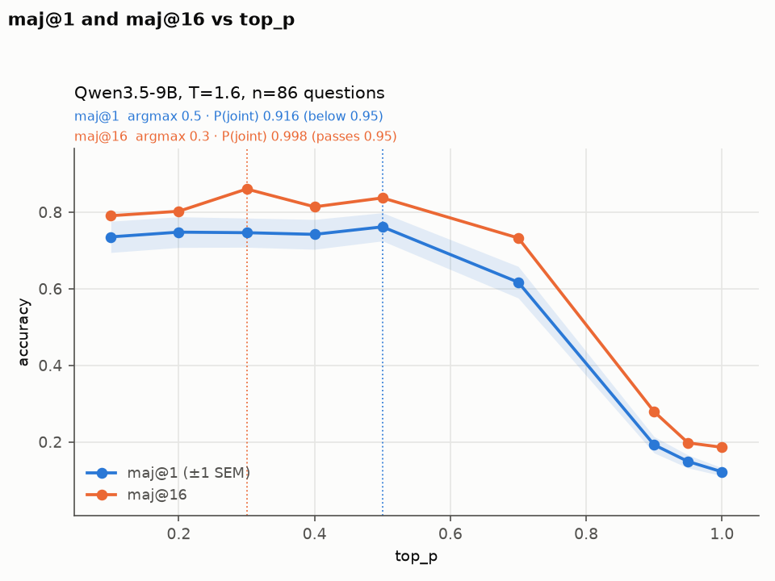

# Does `top_p` have an optimum? A re-run, and the answer

**Question.** As you raise `top_p`, a vision-language model's reasoning gets more varied.
Is there a middle setting that is best — an inverted-U in accuracy?

**Answer.** Not at temperature 1.0, where the previously reported peak turns out to be an
artifact of discarding truncated generations. **Yes at temperature 1.6**, where majority-vote
accuracy has a genuine interior optimum near `top_p`≈0.3–0.5.

`Qwen/Qwen3.5-9B` on MMMU-Pro `standard (10 options)`, 86 questions (5%, seed 20260706),
16 samples per (question, `top_p`) cell, official MMMU-Pro CoT prompt, 2x A100-40GB.
**19,200 traces generated for this work.**

---

## 1. The headline

**T=1.6, 86 questions, 9-point grid, spoiled-ballot counting:**

| k | p=0.1 | p=0.2 | p=0.3 | p=0.4 | p=0.5 | p=0.7 | p=0.9 | p=0.95 | p=1.0 | argmax | F | P(shape) | quad a |
|---|---|---|---|---|---|---|---|---|---|---|---|---|---|
| 1 | 0.7355 | 0.7478 | 0.7464 | 0.7420 | **0.7616** | 0.6170 | 0.1926 | 0.1490 | 0.1221 | 0.5 | 163.8 | 0.916 | −1.51 |
| 2 | 0.7600 | 0.7736 | **0.7767** | 0.7601 | 0.7766 | 0.6210 | 0.2045 | 0.1618 | 0.1402 | 0.3 | 164.2 | 0.912 | −1.47 |
| 4 | 0.7798 | 0.7964 | 0.8096 | 0.7833 | **0.8112** | 0.6713 | 0.2253 | 0.1711 | 0.1503 | 0.5 | 153.8 | **0.959** ✅ | −1.59 |
| 8 | 0.7875 | 0.8049 | 0.8316 | 0.7942 | **0.8333** | 0.7006 | 0.2589 | 0.1834 | 0.1620 | 0.5 | 129.2 | **0.995** ✅ | −1.66 |
| 16 | 0.7907 | 0.8023 | **0.8605** | 0.8140 | 0.8372 | 0.7326 | 0.2791 | 0.1977 | 0.1860 | 0.3 | 72.8 | **0.998** ✅ | −1.71 |

Omnibus repeated-measures ANOVA rejects at p≈0 for every k. The quadratic is decisively
down-opening. The pre-registered shape criterion (P ≥ 0.95) is **met at k=4, 8 and 16**.

**T=1.0, 86 questions, 9-point grid — no interior optimum:**

| k | p=0.5 | p=0.6 | p=0.7 | p=0.8 | p=0.9 | p=0.95 | p=0.98 | p=0.99 | p=1.0 | argmax | P(shape) | quad a |
|---|---|---|---|---|---|---|---|---|---|---|---|---|
| 1 | 0.7536 | 0.7674 | 0.7645 | 0.7725 | 0.7660 | 0.7725 | 0.7791 | **0.7958** | 0.7892 | 0.99 | 0.190 | **+0.10** |
| 16 | 0.8140 | 0.8372 | 0.8488 | 0.8256 | 0.8256 | 0.8140 | 0.8256 | **0.8605** | 0.8605 | 1.0 | 0.335 | −0.04 |

Argmax at the edge at every k, quadratic *up*-opening at k=1–8, shape criterion never above
0.34 against a required 0.95, omnibus rejecting only at k=1 and only in favour of a monotone
rise.



## 2. The finding is strongest exactly where theory says it should be

The shape test strengthens monotonically with vote budget:

| k | 1 | 2 | 4 | 8 | 16 |
|---|---|---|---|---|---|
| P(shape) | 0.916 | 0.912 | **0.959** | **0.995** | **0.998** |

Majority vote is the metric where diversity has value, so it is where a coverage-vs-precision
optimum is theoretically expected. That dose-response in k is stronger evidence than any
single argmax.

The left arm shows the same pattern — it is not significant per-sample, and clearly
significant for majority vote:

| left arm (peak vs `top_p`=0.1) | Δ | p |
|---|---|---|
| k=1 (per-sample) | +2.6 pp | 0.227 |
| k=8 | +4.6 pp | **0.021** |
| k=16 | +7.0 pp | **0.013** |

**The majority-vote result cannot be a counting artifact.** At k = n_samples the draw is the
whole cell, so the spoiled-ballot and exclude rules coincide by construction — both reduce to
"plurality of the valid ballots." They return byte-identical numbers at k=16 (+6.98 pp,
p=0.0134 under both). The k=16 inverted-U is therefore a genuine difference in what the
model's consensus answer *is*, not an effect of how failures are scored.

## 3. Why T=1.0 cannot show an inverted-U, and T=1.6 can

Mechanical, not empirical. At T≤1, lowering `top_p` truncates the tail and renormalises — it
only ever *sharpens*. The axis runs from near-greedy at `top_p`→0 to the model's true
distribution at 1.0, and stops. An inverted-U needs a regime where sampling is *worse than the
model*, which requires inflating the tail. No such regime exists at T≤1, so theory predicts
rise-then-plateau — which is what T=1.0 measures. At T=1.6 the tail is inflated, `top_p`
truncation does real work, and the falling arm appears.

The failure modes separate cleanly, which is the mechanism made visible:

| T=1.6 | p=0.1 | p=0.2 | p=0.3 | p=0.4 | p=0.5 | p=0.7 | p=0.9 | p=0.95 | p=1.0 |
|---|---|---|---|---|---|---|---|---|---|
| truncated (repetition loops) | 9.01% | 10.25% | 9.16% | 7.12% | 4.72% | 0.58% | 0% | 0% | **0%** |
| unparseable (incoherent) | 0% | 0% | 0% | 0% | 0% | 1.60% | 6.10% | 8.58% | **13.44%** |

Low `top_p` fails by looping; high `top_p` fails by emitting text that never yields an answer.
The optimum moves left as temperature rises — the tradeoff lives on the `top_p`×T plane, not
on any single `top_p` sweep.

## 4. Why the original T=1.0 result was wrong

The prior write-up reported an interior peak at `top_p`=0.5 in per-sample accuracy. It came
entirely from dropping generations with `finish_reason != "stop"`, because truncation is not
uniform along the swept axis — 9.23% at `top_p`=0.5 versus 0.07% at 1.0, a 130x gradient.
Deleting those traces inflates exactly the cells that truncate most: it is worth 4.8 pp at
`top_p`=0.5, moves the argmax from the 1.0 edge to 0.5, and was never significant even then
(Holm-adjusted p=0.22).

**Truncated generations are never excluded from a reported result in this work.** A
generation that never produced an answer is a failure that consumed inference budget, not an
event that did not happen. Every cell has exactly 16 *ballots*; a ballot is valid if the trace
terminated and an answer parsed, otherwise it is *spoiled* — it consumes budget and does not
vote. Nothing is silently dropped, every cell has the same denominator, and balancing no
longer discards 39 of 86 questions. **The exclude rule is not implemented in this repo** —
it cannot be selected, so it cannot quietly become a headline again. The numbers above were
measured before it was removed and are preserved as data in `outputs/RESULT_T10.json`
(`exclude_full`), which is also what the figure's panel A is drawn from.

## 5. Method

Pre-registered before any curve was inspected, applied identically to every arm:

- **Omnibus first.** Repeated-measures ANOVA over the `top_p` levels. A null omnibus is
  reported prominently — pairwise tests after one are not evidence.
- **Shape test.** Two-lines: split at the argmax, OLS per segment, require left slope > 0 and
  right slope < 0. Bootstrapped over *questions* (B=20,000), the same resample applied to
  every `top_p` column so pairing is preserved. α=0.05 → the claim stands only at P ≥ 0.95.
- **Joint criterion.** Two-lines alone is too easy to pass: with the argmax on the
  second-to-last grid point the right arm is fitted to two points and reduces to the sign of
  one noisy difference. The reported figure requires the *same* bootstrap replicate to also
  yield a down-opening quadratic. (This caught a false "inverted-U" during development.)
- **Multiplicity.** Pairwise tests against the peak are Holm-corrected; raw and adjusted p
  both reported, never only the winner.
- **Power.** Full set and informative subset (questions not answered identically by all 16
  samples at every `top_p`).
- **No silent exclusions.** Every analysis prints its per-`top_p` spoil rate.

**Config is recorded in the data, not in prose.** Every row carries the complete sampling
config plus a `cfg_profile` tag; `--resume` reads that stamp and aborts on mismatch;
`--sampling-profile` is required with no default. This project's central failure was a run
invalidated by two flags nobody recorded — that can no longer happen silently.

## 6. Caveats

- **A pre-registered secondary prediction FAILED.** The optimum was declared non-decreasing
  in k; it oscillates 0.5 → 0.3 → 0.5 → 0.5 → 0.3. The peak is clearly interior but its exact
  location between 0.3 and 0.5 is unresolved.
- **The k=1 left arm is mostly a decoding pathology.** Among traces that terminated,
  per-sample accuracy is roughly flat across 0.1–0.5. The per-sample evidence for an optimum
  is weak; the majority-vote evidence is not.
- **One mechanism is untested.** Truncation shrinks the vote pool at low `top_p` (~14.6 valid
  ballots instead of 16), and a smaller pool makes the majority noisier. That is a path from
  truncation to the k=16 result. 1.4 fewer votes is a thin explanation for 7 pp, but the
  clean test — subsampling every cell to a common valid-ballot count — has not been run.
- **The T=1.0 raw traces are not in this repo.** The original 11,472-trace dataset was
  deleted on request; `outputs/PHASE1_FINAL.*` preserves the numbers but they cannot be
  recomputed from what is committed. `cots/t10_topup_*` holds only the four levels generated
  here (0.6, 0.8, 0.98, 0.99). **The T=1.6 results are fully reproducible.**
- **One model, one benchmark, 86 questions.** Nothing here is claimed to generalise.
- **`top_p` < 0.5 at T=1.0 was not generated** — dominated by repetition collapse.

## 7. Layout

Three scripts, and the data. Nothing here is scaffolding.

```
cots/                              all 19,200 traces generated for this work (gzipped)
  t16_sweep.shard{0,1}.jsonl.gz    T=1.6, 9-point sweep            12,384
  t10_topup_dense.jsonl.gz         T=1.0, top_p 0.98 / 0.99         2,752
  t10_topup_grid7.jsonl.gz         T=1.0, top_p 0.6 / 0.8           1,376
  qwen_recommended.jsonl.gz        top_k=20 / presence_penalty=1.5  2,688
outputs/
  RESULT_T16.md/.json              T=1.6, 9-point, 86 questions  <- the headline
  RESULT_T10.md/.json              T=1.0, 9-point (not regenerable, see caveats)
  corrected_topp_result.png        the figure
cot_gen.py                         generation (config-stamped, resume-guarded)
analyze.py                         ballot-model maj@k + the pre-registered tests
result_chart.py                    the figure
env_versions.txt                   vLLM / torch / driver versions
```

## 8. Reproduce

The headline (T=1.6) is reproducible end to end from what is committed.

```bash
source /venv/main/bin/activate

# 1. GENERATE (GPU, ~14h on 2x A100-40GB). --sampling-profile is required, no default:
#    the flags that decide this result must never come from an argparse default again.
#    Run once per GPU with --shard-id 0 and 1.
CUDA_VISIBLE_DEVICES=0 python cot_gen.py --sampling-profile neutral \
  --min-p 0 --repetition-penalty 1.0 --temperature 1.6 \
  --sample-frac 0.05 --n-samples 16 --top-ps "0.1,0.2,0.3,0.4,0.5,0.7,0.9,0.95,1.0" \
  --num-shards 2 --shard-id 0 --resume \
  --kv-cache-dtype auto --max-num-seqs 128 --gpu-mem-util 0.95 \
  --max-num-batched-tokens 16384 --chunk-questions 8 \
  --out outputs/t16_gen.jsonl --questions-out outputs/t16_q.json

# 2. ANALYSE (CPU, ~1 min). --temperature is mandatory when two arms share a directory:
#    cells are keyed on (id, top_p), so two temperatures in one glob would merge into
#    32-ballot cells and blend two experiments into a single curve.
python analyze.py --glob "cots/t16_sweep.shard*.jsonl.gz" --temperature 1.6 \
  --grid 0.1,0.2,0.3,0.4,0.5,0.7,0.9,0.95,1.0 --out outputs/RESULT_T16.md

# 3. FIGURE
python result_chart.py
```

Step 2 on the committed traces reproduces `outputs/RESULT_T16.md` bit-identically.

## 9. Next

1. **Equalise the vote pool** across `top_p` (subsample every cell to a common valid-ballot
   count) to close the one untested mechanism behind the k=16 left arm. CPU-only.
2. **Fill the `top_p`×T plane**: T ∈ {0.7, 1.0, 1.3, 1.6}. Prediction is sharp — curvature
   absent at 0.7, increasing through 1.6. A pattern across a grid beats a single argmax.
3. **Densify 0.2–0.6 at T=1.6** to pin the peak location, which the k-oscillation leaves open.
4. **The soundness arm needs redoing before it is cited.** Its premises were extracted with
   truncated traces dropped by default, so the reported slope inherits the bias removed here.
   Independently, the two judging modes of identical claim sets disagreed systematically
   (atomic-pass/holistic-fail 219 vs 3, McNemar p=5.4e-61).
