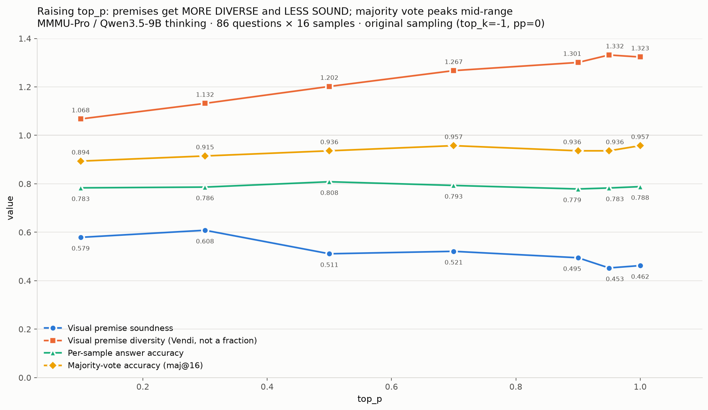

# Sampling diversity vs. visual-premise soundness (MMMU-Pro, Qwen3.5-9B)

**Question:** as you raise `top_p`, a vision-language model's reasoning becomes more varied —
but does it become *less visually accurate*, and is there an optimal middle setting?

**Answer, from this run:**

| measure | direction | strength |
|---|---|---|
| **Visual-premise soundness** — are the model's claims about the image true? | **falls** 0.58 → 0.46 | pearson **−0.91**, slope −0.150 (solid) |
| **Visual-premise diversity** — how varied are those claims across samples? | **rises** Vendi 1.07 → 1.32 | pearson **+0.99** (solid) |
| **Per-sample answer accuracy** | **inverted-U**, peak `top_p≈0.5` | modest: a=−0.080, 2 of 6 paired comparisons significant |
| **Majority-vote accuracy** (self-consistency over 16 samples) | no reliable interior peak | **not established** — see Caveats |

The headline result is the first two together: **raising `top_p` makes the model's visual
readings more varied and less accurate.** That tradeoff is why a middle `top_p` is best for
single-sample accuracy — enough variation to escape a bad reading, not so much that
perception degrades.


All four measures on one axis, every point labelled:



---

## ⚠️ Required sampling flags — the defaults suppress the effect

Generation **must** be run with:

```
--top-k -1  --presence-penalty 0  --min-p 0  --repetition-penalty 1.0  --temperature 1.0
```

`cot_gen.py`'s argparse **defaults** are `top_k=20, presence_penalty=1.5`. Those exist to
suppress repetition loops at low `top_p`, and they **erase the phenomenon being measured**:
`top_k=20` caps the candidate pool to 20 tokens regardless of `top_p`, so sweeping `top_p`
barely changes the sampling distribution, and `presence_penalty=1.5` suppresses exactly the
degradation that makes high `top_p` worse. Under the defaults every curve here goes flat or
monotonic.

A full generation run was completed with the defaults before this was noticed, and produced a
confident null result. **Pass the flags explicitly.** The truncation they reintroduce (~5% of
traces degenerate into repetition loops, concentrated at low `top_p`) is handled downstream by
dropping `finish_reason != "stop"`.

## Setup

| | |
|---|---|
| Dataset | `MMMU/MMMU_Pro`, config `standard (10 options)`, split `test` (1730 questions) |
| Sample | **86 questions** = 5%, deterministic (`--sample-frac 0.05 --sample-seed 20260706`) |
| Generator | `Qwen/Qwen3.5-9B`, thinking mode on, **16 samples** per (question, `top_p`) |
| Prompt | the official MMMU-Pro `cot.standard` prompt, verbatim, with the official assembly |
| `top_p` grid | **0.1, 0.3, 0.5, 0.7, 0.9, 0.95, 1.0** (all 86 questions) — plus partial 0.4/0.6/0.8 |
| Generations | **11,472** traces; the 7 complete `top_p` (9,632 traces) carry all reported numbers |
| Judge | `OpenGVLab/InternVL3-38B-AWQ` — a different model family from the generator, and **never shown the gold answer** |
| Hardware | 3x A100-40GB |

Despite the config name, only ~70% of `standard (10 options)` questions actually have 10
options (True/False items stay at 2, etc.). All parsing keys off `len(options)` per question.

## Method

1. **Generate** — `cot_gen.py`: 16 thinking traces per (question, `top_p`) cell, data-parallel
   across GPUs. Each GPU takes a strided slice of questions and writes its own shard file.
2. **Extract visual premises** — `extract_premises.py` (Qwen3.5-9B, non-thinking, temp 0) pulls
   the *atomic claims about what is in the image* out of each `<think>` trace — "the graph is a
   straight line", "the first column reads −3,000" — while excluding arithmetic, derivations,
   goals and inference. → **7,964 premises from 1,352 traces**.
3. **Judge against the image** — `judge_holistic.py` (InternVL3-38B-AWQ, temp 0, **no gold**)
   verifies a trace's visual claims **holistically**: all claims shown together, and *any single
   wrong detail fails the trace*. → **1,015 traces judged, 52.2% fully correct**.
4. **Analyze** — `holistic_trend.py` (soundness), `premise_diversity.py` (Vendi / cosine over
   premise embeddings), `majk.py` (maj@k subsampled from the 16 banked samples).

### Two methodological traps this run hit — worth knowing before repeating it

**Judging premises one-by-one saturates and cannot detect the effect.** Atomic claims like
"the waveform is a triangle pulse" are individually trivial: the per-premise judge scored
**~97% sound** with essentially no variance, and no trend was measurable at any `top_p`.
Judging the *same* claims holistically (all-or-nothing per trace) scored **52.2%** — real
dynamic range — and the trend appeared immediately. The saturated verdicts are kept as
`outputs/u_verdicts_atomic_saturated.jsonl.gz` so the contrast is inspectable.

**Every comparison must be balanced on question ids.** `top_p` cells finish at different times
and truncate at different rates, so an unbalanced mean compares *different question sets*, and
question difficulty masquerades as a `top_p` effect. This flipped the sign of intermediate
results more than once here. Every number reported restricts to questions present at **every**
compared `top_p`.

## Results in detail

**Visual-premise soundness** (fraction of traces whose every visual claim is correct), balanced
on 50 shared questions, n=95 traces per point, SE ≈ ±0.05:

| top_p | 0.1 | 0.3 | 0.5 | 0.7 | 0.9 | 0.95 | 1.0 |
|---|---|---|---|---|---|---|---|
| soundness | 0.579 | 0.608 | 0.511 | 0.521 | 0.495 | 0.453 | 0.462 |

slope −0.150, pearson −0.908, spearman −0.893. The spread (0.155) is ~3x the standard error.

**Visual-premise diversity** (Vendi score over premise-set embeddings; 1.0 = all samples
identical):

| top_p | 0.1 | 0.3 | 0.5 | 0.7 | 0.9 | 0.95 | 1.0 |
|---|---|---|---|---|---|---|---|
| Vendi | 1.068 | 1.132 | 1.202 | 1.267 | 1.301 | 1.332 | 1.323 |
| cos-dist | 0.032 | 0.062 | 0.107 | 0.135 | 0.159 | 0.177 | 0.169 |

pearson +0.99 on the per-`top_p` means (+0.50 across individual cells). Mean pairwise cosine
distance rises ~5x across the range.

**Per-sample answer accuracy**, balanced on 84 questions (each question contributes the
fraction of its 16 samples that were correct):

| top_p | 0.1 | 0.3 | 0.5 | 0.7 | 0.9 | 0.95 | 1.0 |
|---|---|---|---|---|---|---|---|
| accuracy | 0.7833 | 0.7864 | **0.8084** | 0.7932 | 0.7787 | 0.7827 | 0.7883 |

Interior peak at `0.5`, quadratic a=−0.080. Paired t-tests of `0.5` against each other point:
significant vs `0.9` (t=+2.37) and `0.95` (t=+2.09); not significant vs `0.1`, `0.3`, `0.7`,
`1.0` (t≈1.2–1.5). All six differences point the same way, which is what a genuine interior
optimum looks like — but the effect is only ~2–3 percentage points.

## Layout

_All `.jsonl` data is gzipped (the CoTs compress ~8.5x; raw shards exceed GitHub's 100 MB file limit)._

```
├── README.md
├── cots/                         ALL generated chain-of-thought traces
│   └── u_gen.shard{0,1,2}.jsonl.gz    11,472 traces total; one JSON object per sample.
│                                      Shards are just the 3 GPUs' strided question slices —
│                                      concatenate them, order carries no meaning.
├── outputs/
│   ├── FINAL_SUMMARY.md          the numbers above, generated by make_summary.py
│   ├── u_final_chart.png         3 panels: soundness | diversity | majority vote
│   ├── u_single_chart_labeled.png  all four measures on one axis, every point labelled
│   ├── u_verdicts_holistic.jsonl.gz    1,015 holistic judgements  <- the soundness result
│   ├── u_verdicts_atomic_saturated.jsonl.gz   per-premise judging — the saturated control
│   ├── u_premises.jsonl.gz       7,964 extracted visual premises
│   ├── u_premise_diversity.json  Vendi / cosine per (question, top_p)
│   └── u_q.shard*.json           question metadata (id → subject, gold, dataset index)
├── cot_gen.py                    generation (official prompt + assembly)
├── extract_cot.py                split the <think> trace, parse "Answer: X"
├── extract_premises.py           visual-premise extraction
├── judge_holistic.py             holistic image-grounded judge  <- produces the result
├── judge_premises_internvl.py    per-premise judge (saturates; kept for contrast)
├── premise_diversity.py          Vendi / cosine over premise embeddings
├── holistic_trend.py             soundness vs top_p, balanced
├── soundness_trend.py            atomic-verdict trend (pooled / specific / conjunction)
├── majk.py                       maj@k, subsampled from the 16 samples, per-k balanced
├── analyze_cot.py                vendi() / cosd() / corr() / MiniLM embedding helpers
├── make_summary.py               writes FINAL_SUMMARY.md
├── final_chart.py                writes u_final_chart.png
├── single_chart_labeled.py       writes u_single_chart_labeled.png
└── run_vpU.sh                    generation launcher (required sampling flags baked in)
```

## Scripts actually run to produce these results

Hardware: 3x A100-40GB, used as GPUs 0, 2 and 3.

```bash
# 1. GENERATION — 86 questions x 11 top_p x 16 samples, sharded over 3 GPUs.
#    The sampling flags are the whole ballgame (see the warning above).
./run_vpU.sh
#    which runs, for shard s=0,1,2 on GPU g=0,2,3:
#      CUDA_VISIBLE_DEVICES=$g python cot_gen.py \
#        --sample-frac 0.05 --n-samples 16 \
#        --top-ps 1.0,0.9,0.95,0.7,0.5,0.3,0.1,0.8,0.6,0.4,0.2 \
#        --top-k -1 --presence-penalty 0 --min-p 0 --repetition-penalty 1.0 --temperature 1.0 \
#        --num-shards 3 --shard-id $s --resume \
#        --kv-cache-dtype auto --max-num-seqs 128 --gpu-mem-util 0.95 \
#        --out outputs/u_gen.jsonl --questions-out outputs/u_q.json

# 2. PARSE the <think> traces and the "Answer: X" lines
cat outputs/u_gen.shard*.jsonl > outputs/u_gen.jsonl
python extract_cot.py --gen outputs/u_gen.jsonl --out outputs/u_extracted.jsonl

# 3. EXTRACT visual premises (Qwen3.5-9B, non-thinking, temp 0) — samples 0-1 only
CUDA_VISIBLE_DEVICES=3 python extract_premises.py \
  --extracted outputs/u_extracted.jsonl --out outputs/u_premises.jsonl \
  --judge-samples 2 --gpu-mem-util 0.90 --max-num-seqs 128 --batch 512

# 4. JUDGE holistically vs the image (InternVL3-38B-AWQ, TP=2, NO gold)  <- the soundness result
CUDA_VISIBLE_DEVICES=0,2 python judge_holistic.py \
  --premises outputs/u_premises.jsonl --questions outputs/u_q.json \
  --out outputs/u_verdicts_holistic.jsonl \
  --tensor-parallel-size 2 --gpu-mem-util 0.88 --max-num-seqs 16 --max-model-len 16384 --batch 96

# 4b. per-premise judge, kept as the saturated negative control (~97%, no dynamic range)
CUDA_VISIBLE_DEVICES=3 python judge_premises_internvl.py \
  --premises outputs/u_premises.jsonl --questions outputs/u_q.json \
  --out outputs/u_verdicts_atomic_saturated.jsonl \
  --tensor-parallel-size 1 --gpu-mem-util 0.90 --max-num-seqs 4 --max-model-len 12288 --batch 64

# 5. ANALYSIS + FIGURES
python holistic_trend.py                        # soundness vs top_p (balanced)
python soundness_trend.py                       # the atomic control, for contrast
python premise_diversity.py                     # Vendi / cosine vs top_p
python make_summary.py > outputs/FINAL_SUMMARY.md
python final_chart.py                           # outputs/u_final_chart.png
python single_chart_labeled.py                  # outputs/u_single_chart_labeled.png
```

All `.jsonl` outputs were gzipped before committing.

## Caveats

- **The majority-vote inverted-U is NOT established by this data.** At maj@16 the highest value
  is a *tie* between `top_p=0.7` and `top_p=1.0` (both 45 of 47 questions), so an apparent
  "interior peak at 0.7" is an argmax tie-break, not a real maximum. The whole maj@16 curve
  spans only 42→45 correct questions — a 3-question range — and the dip at 0.9/0.95 is a single
  question. At maj@6, where more questions are usable (n=79), the maximum sits at the `1.0`
  **edge**. Treat the inverted-U claim as resting on **per-sample accuracy** (a genuine,
  non-tied interior peak at 0.5), not on majority vote.
- **The soundness arm uses 2 of the 16 samples per cell** (judging cost). After balancing that
  is n=95 traces per `top_p`, SE ≈ ±0.05. Re-run `extract_premises.py --judge-samples 4` and
  re-judge to roughly double it.
- **`top_p` = 0.4 / 0.6 / 0.8 are partial** (29–57 of 86 questions): generation was paused there
  to free GPUs for judging. They are excluded from every reported number — including them
  shrinks the balanced question set from 50 to 15 and adds noise. Their traces *are* in
  `cots/` if you want to complete them.
- **The extraction and judge prompts are ours, not part of any benchmark spec.** Only the
  generation prompt is the official MMMU-Pro one. The judge is a 4-bit (AWQ) quantized model:
  its language half is int4, its vision encoder stays bf16.
- **Soundness is judged, not ground truth.** It measures what a strong VLM, shown the image and
  no gold answer, will certify — not verified fact.
