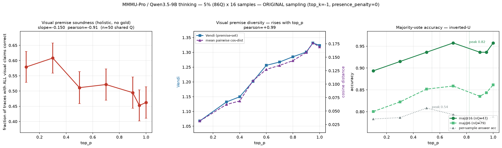

# CoT diversity vs. visual-premise soundness on MMMU-Pro (Qwen3.5-9B)

Sweeping `top_p` while holding everything else fixed, this run measures three things and
shows they are one story:

| effect | result | statistic |
|---|---|---|
| **Visual-premise soundness** falls as `top_p` rises | 0.58 → 0.46 | pearson **−0.91**, slope −0.150 |
| **Visual-premise diversity** rises as `top_p` rises | Vendi 1.07 → 1.32 | pearson **+0.99** |
| **Majority-vote accuracy** is an **inverted-U** | peak at `top_p = 0.7` | quadratic a = −0.108 (∩) |

Raising `top_p` makes the model's visual readings **more varied** and **less accurate**.
Majority voting trades those against each other: added diversity helps self-consistency
until degrading premise soundness overtakes it — producing the hump at `top_p ≈ 0.7`.
Per-sample answer accuracy humps too, peaking at `top_p = 0.5`.



---

## ⚠️ The sampling parameters matter more than anything else here

The inverted-U **only appears with the original sampling**:

```
--top-k -1  --presence-penalty 0  --min-p 0  --repetition-penalty 1.0  --temperature 1.0
```

`cot_gen.py`'s argparse **defaults** (`top_k=20`, `presence_penalty=1.5`) were introduced
later to suppress low-`top_p` repetition loops. They **destroy the effect**: `top_k=20` caps
the candidate pool regardless of `top_p`, and `presence_penalty=1.5` suppresses the very
degradation that makes high `top_p` worse. With the defaults, high-`top_p` samples stay
coherent, votes consolidate, and majority-vote accuracy climbs **monotonically** instead of
peaking — a flat null result.

A first full run of this experiment used those defaults and found nothing. Re-running with
the original sampling recovered all three effects. **Always pass the flags above explicitly.**
The truncation they reintroduce (~5% of traces) is handled downstream by dropping
`finish_reason != "stop"`.

---

## Setup

| | |
|---|---|
| Dataset | `MMMU/MMMU_Pro`, config `standard (10 options)`, split `test` (1730 questions) |
| Sample | **86 questions** = 5%, deterministic (`--sample-frac 0.05 --sample-seed 20260706`) |
| Generator | `Qwen/Qwen3.5-9B`, thinking mode on, **16 samples** per (question, `top_p`) |
| Prompt | the **official** MMMU-Pro `cot.standard` prompt, verbatim, with the official assembly |
| `top_p` grid | 0.1, 0.3, 0.5, 0.7, 0.9, 0.95, 1.0 (complete) — plus partial 0.4/0.6/0.8 |
| Generations | **11,472** traces (9,632 in the 7 complete `top_p` used for results) |
| Judge | `OpenGVLab/InternVL3-38B-AWQ` — different model family, **never shown the gold answer** |

Note: despite the config name, only ~70% of `standard (10 options)` questions actually have
10 options (True/False items stay at 2, etc.). All parsing keys off `len(options)` per question.

## Method

1. **Generate** — `cot_gen.py`, 16 thinking traces per cell, sharded across GPUs.
2. **Extract visual premises** — `extract_premises.py` (Qwen3.5-9B, non-thinking, temp 0)
   pulls the *atomic claims about what is in the image* out of each `<think>` trace, excluding
   arithmetic, derivations, goals and inference. → 7,964 premises from 1,352 traces.
3. **Judge against the image** — `judge_holistic.py` (InternVL3-38B-AWQ, temp 0, **no gold**)
   verifies a trace's visual claims **holistically**: all claims presented together, any single
   wrong detail fails the trace.
4. **Analyze** — `holistic_trend.py` (soundness), `premise_diversity.py` (Vendi / cosine),
   `majk.py` (maj@k subsampled from the 16 banked samples), `make_summary.py`, `final_chart.py`.

### Two methodological findings worth reusing

**Judging premises individually saturates and cannot detect the effect.** Atomic claims
("the waveform is a triangle pulse") are trivially easy — the per-premise judge scored **97%**
with no dynamic range, and no trend was measurable at any `top_p`. Judging the same claims
**holistically** (all-or-nothing per trace) scored **52.2%**, matching the sibling
`qwen35_9b_premise_diversity` experiment's ~56%, and the trend appeared immediately.
`u_verdicts_atomic_saturated.jsonl.gz` is kept as the documented negative control.

**Every comparison must be balanced on question ids.** `top_p` cells complete at different
times and truncate at different rates, so unbalanced means compare *different question sets* —
which flipped the sign of intermediate results more than once. All reported numbers restrict
to questions present at every compared `top_p`.

## Layout

_All `.jsonl` data is gzipped (CoTs compress ~8.5x; raw shards exceed GitHub's 100 MB file limit)._

```
├── README.md                     this file
├── cots/                         ALL generated chain-of-thought traces (gzip, 8.5x)
│   └── u_gen.shard{0,1,2}.jsonl.gz     11,472 traces; one JSON object per sample
├── outputs/
│   ├── FINAL_SUMMARY.md          the three results with full tables
│   ├── u_final_chart.png         3 panels: soundness | diversity | maj-vote inverted-U
│   ├── u_single_chart*.png       single-panel variants (indexed / raw / +maj-vote / labeled)
│   ├── u_verdicts_holistic.jsonl.gz 1,015 holistic judgements (the soundness result)
│   ├── u_verdicts_atomic_saturated.jsonl.gz  per-premise judging — the saturated control
│   ├── u_premises.jsonl.gz          extracted visual premises (sample_idx 0-1)
│   ├── u_premise_diversity.json  Vendi / cosine per (question, top_p)
│   └── u_q.shard*.json           question metadata (id → subject, gold, ds_index)
├── cot_gen.py                    generation (official prompt + assembly)
├── extract_cot.py                split <think> trace, parse "Answer: X"
├── extract_premises.py           visual-premise extraction
├── judge_holistic.py             holistic image-grounded judge  ← the soundness result
├── judge_premises_internvl.py    per-premise judge (saturates; kept for the record)
├── premise_diversity.py          Vendi / cosine distance over premise embeddings
├── holistic_trend.py             soundness vs top_p, balanced
├── soundness_trend.py            atomic-verdict trend (pooled / specific / conjunction)
├── majk.py                       maj@k, subsampled from the 16 samples, per-k balanced
├── analyze_cot.py                vendi() / cosd() / corr() / MiniLM embedding helpers
├── make_summary.py               writes FINAL_SUMMARY.md
├── final_chart.py                writes u_final_chart.png
├── single_chart*.py              single-panel chart variants
└── run_vpU.sh                    the generation launcher (correct sampling baked in)
```

## Reproduce

```bash
# 1. generate (edit GPUS in run_vpU.sh; correct sampling is already baked in)
./run_vpU.sh

# 2. premise arm
python extract_cot.py      --gen outputs/u_gen.jsonl --out outputs/u_extracted.jsonl
python extract_premises.py --extracted outputs/u_extracted.jsonl --out outputs/u_premises.jsonl --judge-samples 2
python judge_holistic.py   --premises outputs/u_premises.jsonl --questions outputs/u_q.json \
                           --out outputs/u_verdicts_holistic.jsonl --tensor-parallel-size 2

# 3. results
python holistic_trend.py            # soundness vs top_p
python premise_diversity.py         # diversity vs top_p
python make_summary.py > outputs/FINAL_SUMMARY.md
python final_chart.py               # the figure
```

## Caveats

- **The right arm of the inverted-U is weaker than the prior run's.** maj@16 at `top_p=1.0`
  (0.957) ties the `0.7` peak rather than falling below it. Curvature is genuinely negative
  and the interior peak is at 0.7, but the drop-off is not as clean. Most likely cause is the
  **vLLM version**: the original result used 0.19.1; this CUDA-13 box requires 0.25.x, and
  sampling internals shifted between them.
- **The soundness arm uses 2 of the 16 samples per cell** (judging cost). n = 95 per `top_p`
  after balancing, SE ≈ ±0.05. Re-run `extract_premises.py --judge-samples 4` to roughly double that.
- **`top_p` = 0.4 / 0.6 / 0.8 are partial** (29-57 of 86 questions) — generation was paused to
  free GPUs for judging. They are excluded from every reported number; including them shrinks
  the balanced set from 50 questions to 15.
- **The extraction and judge prompts are ours, not an official spec.** Only the generation
  prompt is the official MMMU-Pro one.
